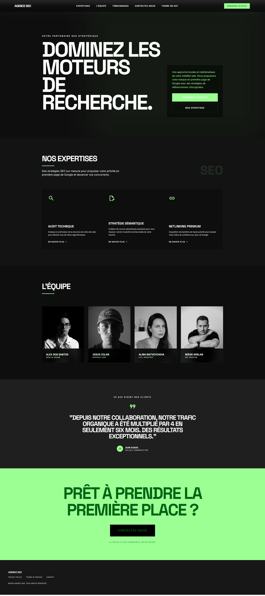

# 🌑 Kinetic Noir - Free Elementor Landing Page

Kinetic Noir est un template Elementor de haute performance, conçu pour une esthétique sombre, brutale et cinétique. Tout le design est encapsulé dans un **plugin compagnon** qui ajoute un widget sur mesure à votre éditeur Elementor.

## ✨ Caractéristiques

- 🌑 **Design Dark Brutalist** : Une interface sombre avec des contrastes élevés et une typographie forte.
- 🚀 **Performance** : Utilise Tailwind CSS pour un rendu léger et précis.
- 🧩 **Widget Tout-en-Un** : Plus besoin d'importer de fichier JSON. Le widget contient toute la structure et le style.
- 📱 **Fully Responsive** : Adapté pour mobiles et tablettes.

## ⚙️ Installation Gratuite

Pour mettre en place cette landing page gratuitement, suivez ces étapes :

### 1. Installation du Plugin
1. Téléchargez ce dossier (ou clonez-le).
2. Compressez le contenu du dossier (ou le dossier lui-même) en `.zip`.
3. Dans WordPress, allez dans **Extensions > Ajouter** et téléversez le fichier `.zip`.
4. **Activez** l'extension "Kinetic Noir Elementor Template".

### 2. Création de la Page
1. Créez une nouvelle page avec Elementor.
2. Recherchez le widget nommé **Kinetic Noir Hero** dans la barre latérale.
3. Glissez-le dans votre page. 
4. C'est tout ! Le design s'affiche instantanément.

---
*Développé pour l'excellence visuelle et cinétique.*
